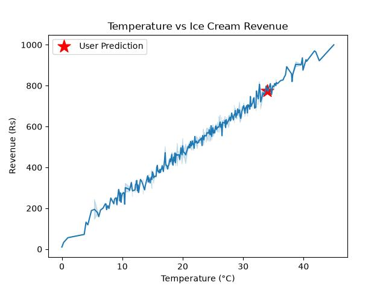

# 🍦 Temperature vs Ice Cream Revenue Prediction using Polynomial Regression

A Machine Learning project that predicts **Ice Cream Revenue** based on the current **Temperature** using **Polynomial Regression**.

The model is trained on historical temperature and revenue data and can estimate expected revenue for a user-provided temperature.

---

## 🚀 Features

- Predicts Ice Cream Revenue using Polynomial Regression.
- Uses Degree = 2 Polynomial Features.
- Accepts user input from the terminal.
- Warns users when the input temperature is outside the training range (5°C–55°C).
- Saves the trained model using Pickle.
- Visualizes the relationship between Temperature and Revenue.

---

## 📂 Project Structure

```
Temp. vs Ice Cream Sales/
│── venv/
│── Ice Cream.csv
│── ice_cream_model.pkl
│── project.py
│── requirements.txt
│── README.md
│── temperature_vs_ice_cream_revenue.png
```

---

## 🛠️ Technologies Used

- Python
- NumPy
- Pandas
- Scikit-learn
- Matplotlib
- Seaborn
- Pickle

---

## ⚙️ Installation

Clone the repository

```bash
git clone https://github.com/suraj-tiwari18/Polynomial-Regression-Ice-Cream-Revenue-Prediction.git
```

Move into the project directory

```bash
cd Polynomial-Regression-Ice-Cream-Revenue-Prediction
```

Create a virtual environment

```bash
python -m venv venv
```

Activate the virtual environment

### Windows

```bash
venv\Scripts\activate
```

Install the required packages

```bash
pip install -r requirements.txt
```

---

## ▶️ Run the Project

```bash
python project.py
```

Example

```
Enter the current Temperature in your area (eg: 35.5): 32

Estimated Revenue from Ice Cream Sales: ₹726.48
```

If the entered temperature is outside **5°C to 55°C**, the model displays a warning because predictions outside the training range may not be reliable.

---

## 📊 Machine Learning Workflow

- Load Dataset
- Data Preprocessing
- Generate Polynomial Features
- Train Polynomial Regression Model
- Predict Revenue
- Save Model using Pickle
- Visualize Temperature vs Revenue

---

## 📈 Output

Example visualization:



---

## ⚠️ Note

This model is trained only on the available dataset.

Predictions for temperatures below **5°C** or above **55°C** are extrapolated and may not accurately represent real-world ice cream sales.

---

## 👨‍💻 Author

**Suraj Tiwari**

GitHub: https://github.com/suraj-tiwary18

LinkedIn: https://linkedin.com/in/suraj-tiwari-580984332/